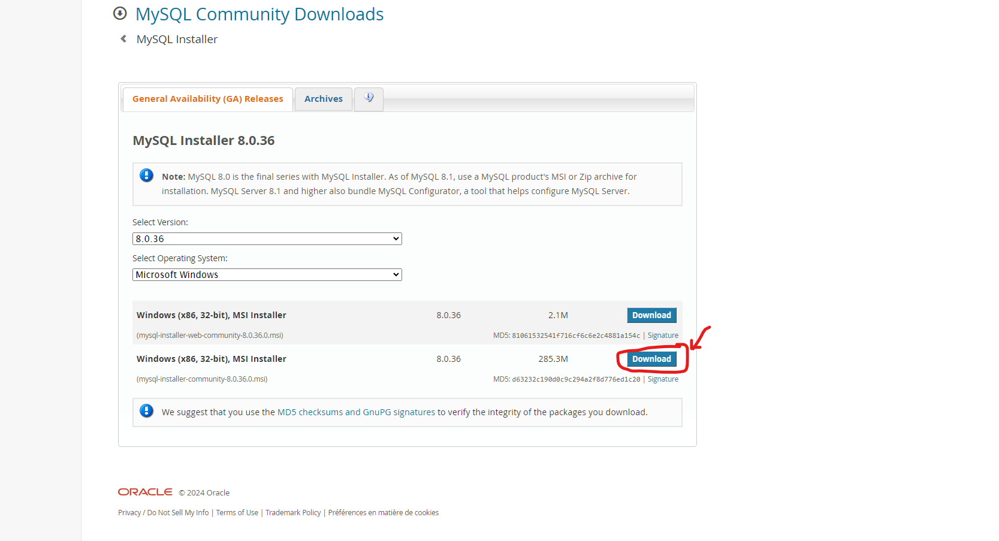
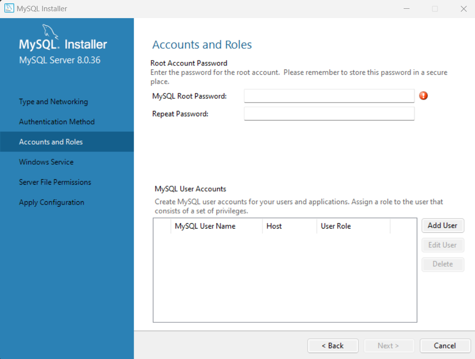
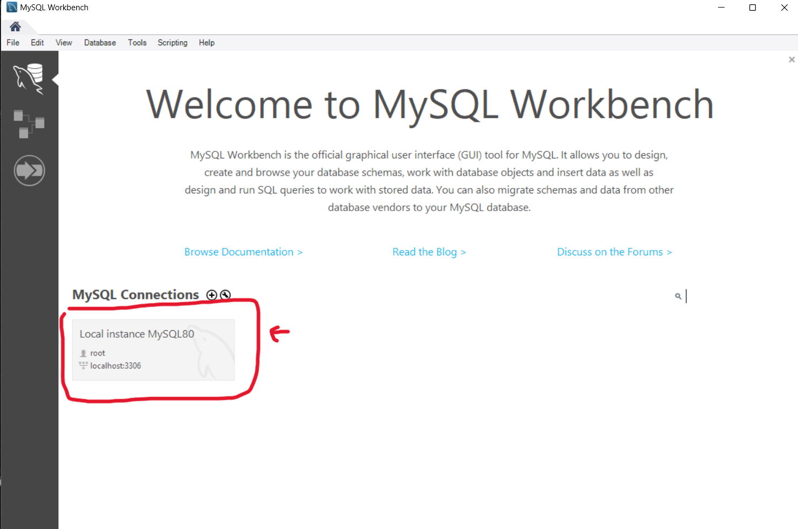
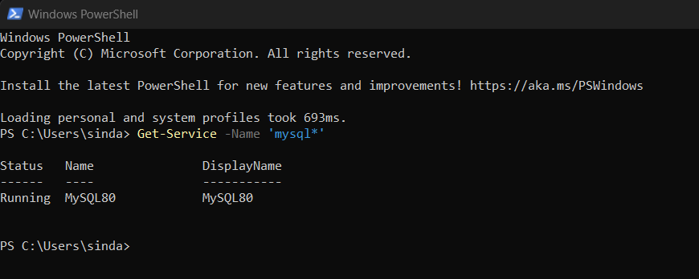
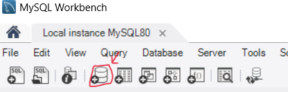
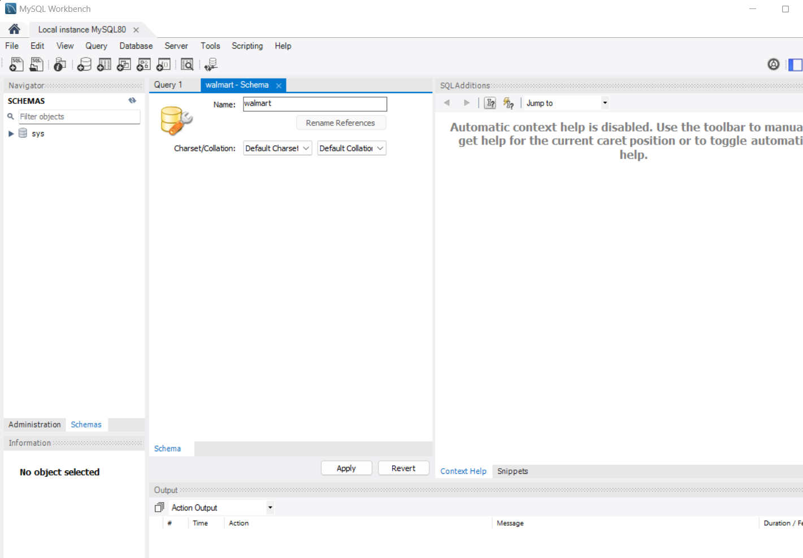
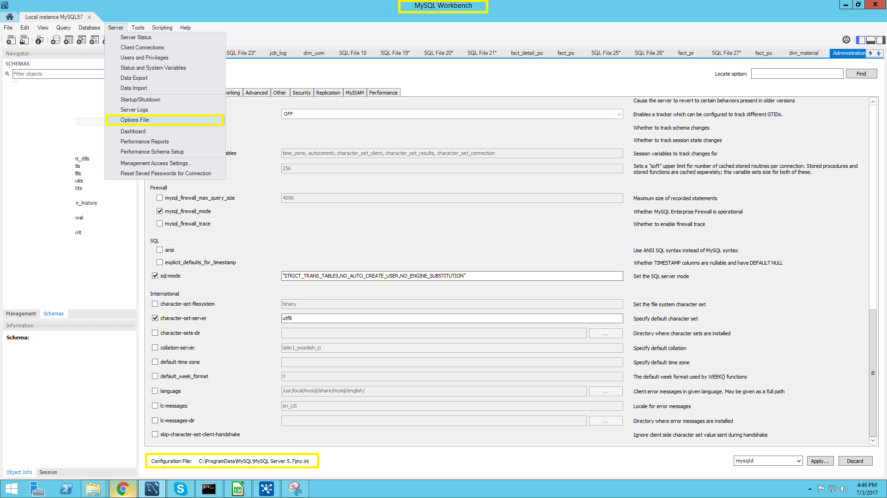

# An SQL example with Python

## Description
Connect to SQL server via a python script, create a table from a csv file, and select information.

## Steps

### SQL server

1. Download MySQL installer https://dev.mysql.com/downloads/installer/
 

2. Proceed with installation (defaut params) and choose a root password
 

3. Install MySQL Workbench from https://dev.mysql.com/downloads/workbench/ (leave default params)

4. Launch MySQL Workbench and then start root connection (type the password you created during the installation)
 

5. Check that SQL server is on (Launch PowerShell and run the following command: ***Get-service -Name 'mysql*' ***) \
Output:
 

6. Back to MySQL Workbench, create a new schema named ***walmart***
 
 

7. Remove restrictions to load data from a csv file
    - Check my.ini file path 
     \
    - Open Notepad as admin, then select File>Open \
    - paste my.ini file path in file explorer and open it \
    - Remove the restriction by setting the the variable ***secure-file-priv*** to an empty string: ***secure-file-priv=""*** \
    - Restart the root connection

